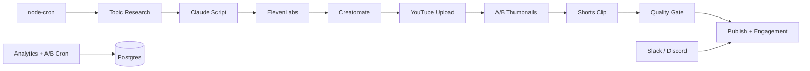

# YouTube Video Pipeline

Multi-tenant automated YouTube video generation and upload pipeline built with TypeScript, Postgres (Neon), and designed for [Railway](https://railway.app) deployment.

## Growth-focused pipeline

Each run follows a **research → script → voice → video → thumbnail → Shorts → quality gate → publish** flow:

1. **Topic research** — YouTube autocomplete + Claude scoring, informed by top performers
2. **Retention script** — Hook-first structure, A/B thumbnail copy, Shorts title, pinned comment
3. **Per-scene TTS** — ElevenLabs per scene with ffmpeg concat and Creatomate duration sync
4. **Custom thumbnails** — A/B variants (Creatomate or ffmpeg); variant A uploaded first
5. **Shorts derivative** — 30–59s vertical clip from hook, uploaded alongside long-form
6. **Engagement automation** — Playlist insert, watch-next link, pinned comment on publish
7. **Quality gate** — Scores packaging; optional auto-publish when score ≥ 70
8. **Analytics + A/B** — Daily sync; auto-swap to thumbnail B if CTR underperforms after 24h
9. **Webhooks** — Slack/Discord alerts for pending review, publish, failures, monetization

## Architecture



## Quick Start

```bash
cp .env.example .env
npm install
npm run build
npm run migrate-channel
npm start
```

## Per-channel settings

| Field | Default | Purpose |
|-------|---------|---------|
| `target_duration_minutes` | 10 | Script length target |
| `auto_publish` | false | Auto-publish when quality ≥ 70 |
| `auto_generate_shorts` | true | Create vertical Short from hook |
| `enable_ab_thumbnails` | true | Generate + track A/B thumbnail variants |
| `enable_engagement` | true | Playlist, watch-next, pinned comment |
| `default_playlist_id` | — | YouTube playlist for binge watching |

## API Endpoints

All routes require `x-auth-token: <AUTH_TOKEN>`.

| Method | Path | Description |
|--------|------|-------------|
| `POST` | `/api/run-pipeline` | Run full pipeline |
| `GET` | `/api/pending` | Videos awaiting review |
| `POST` | `/api/publish/:video_id` | Publish + engagement automation |
| `POST` | `/api/analytics/sync` | Sync views, CTR, monetization stats |
| `POST` | `/api/thumbnails/ab-evaluate` | Run thumbnail A/B swap evaluation |
| `GET` | `/api/monetization` | Channel monetization + analytics sync |

## Cron jobs

| Schedule | Job |
|----------|-----|
| Per channel `upload_frequency` | Generate pipeline run |
| Every 5 min | Reload channel cron jobs |
| Daily 03:00 UTC | Analytics sync + monetization webhooks |
| Daily 04:00 UTC | Thumbnail A/B evaluation + auto-swap |

## Webhooks

Set `SLACK_WEBHOOK_URL` and/or `DISCORD_WEBHOOK_URL` in Railway. Notifications fire for:

- **Pending review** — video ready, awaiting manual publish
- **Published** — video went public with engagement applied
- **Pipeline failed** — generation error with message
- **Monetization approaching** — 800+ subs and 3500+ watch hours
- **Monetization eligible** — 1K subs + 4K watch hours reached
- **Thumbnail A/B swap** — variant B applied due to low CTR

Toggle with `WEBHOOK_NOTIFY_*` env vars (see `.env.example`).

## OAuth scopes

Run `npm run get-token` — requires re-auth after upgrades:

- `youtube.upload`, `youtube.readonly`, `yt-analytics.readonly`, `youtube.force-ssl`

## Environment Variables

Required: `NEON_DATABASE_URL`, `ENCRYPTION_KEY`, `AUTH_TOKEN`, `ANTHROPIC_API_KEY`, `ELEVENLABS_API_KEY`, `CREATOMATE_API_KEY`, `PUBLIC_BASE_URL`

Recommended: `CREATOMATE_THUMBNAIL_TEMPLATE_ID`, `SLACK_WEBHOOK_URL` or `DISCORD_WEBHOOK_URL`

## License

MIT
