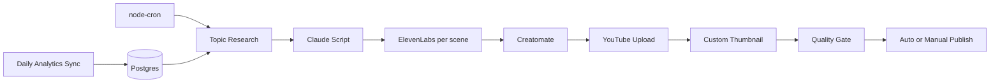

# YouTube Video Pipeline

Multi-tenant automated YouTube video generation and upload pipeline built with TypeScript, Postgres (Neon), and designed for [Railway](https://railway.app) deployment.

## Growth-focused pipeline

Each run follows a **research → script → voice → video → thumbnail → quality gate → publish** flow optimized for views and monetization:

1. **Topic research** — YouTube autocomplete + Claude scoring, informed by top-performing past topics
2. **Retention script** — Hook-first structure, target duration, chapters, SEO metadata
3. **Per-scene TTS** — ElevenLabs per scene with ffmpeg concat and duration metadata for Creatomate
4. **Custom thumbnail** — Creatomate thumbnail template or ffmpeg frame extract → `thumbnails.set`
5. **Quality gate** — Scores title, hook, length, tags; blocks auto-publish if below threshold
6. **Analytics sync** — Daily cron pulls views, CTR, AVD; feeds topic research loop

## Architecture



## Quick Start

```bash
cp .env.example .env
npm install
npm run build
npm run migrate-channel   # one-time: import legacy .env channel into DB
npm start
```

Trigger a channel pipeline manually:

```bash
curl -X POST http://localhost:3000/api/run-pipeline \
  -H "x-auth-token: $AUTH_TOKEN" \
  -H "Content-Type: application/json" \
  -d '{"channel_id":"<uuid>","topic":"Optional specific topic"}'
```

## Per-channel growth settings

| Field | Default | Purpose |
|-------|---------|---------|
| `target_duration_minutes` | 10 | Script length target (~150 words/min) |
| `audience_level` | general | beginner / intermediate / advanced / general |
| `title_style` | curiosity | curiosity / question / listicle / story / controversy |
| `auto_publish` | false | Publish automatically when quality gate passes (≥70) |
| `require_thumbnail` | true | Quality gate requires custom thumbnail upload |
| `youtube_category_id` | 28 | Per-channel YouTube category |
| `creatomate_thumbnail_template_id` | — | Optional dedicated thumbnail template |

## API Endpoints

All routes require `x-auth-token: <AUTH_TOKEN>` (or `Authorization: Bearer`).

| Method | Path | Description |
|--------|------|-------------|
| `POST` | `/api/channels` | Create a channel |
| `GET` | `/api/channels` | List channels with stats |
| `PATCH` | `/api/channels/:id` | Update channel settings |
| `POST` | `/api/run-pipeline` | Run full pipeline for a channel |
| `GET` | `/api/pending` | Private videos awaiting review |
| `POST` | `/api/publish/:video_id` | Manually publish a reviewed video |
| `GET` | `/api/costs` | Monthly cost summary |
| `GET` | `/api/monetization` | Refresh channel stats + sync video analytics |
| `POST` | `/api/analytics/sync` | Trigger analytics sync manually |

## Cron jobs

| Schedule | Job |
|----------|-----|
| Per channel `upload_frequency` | Generate + upload video |
| Every 5 minutes | Reload channel cron jobs |
| Daily 03:00 UTC | Sync YouTube analytics for all videos/channels |

## OAuth scopes

Run `npm run get-token` to obtain a refresh token. Required scopes:

- `youtube.upload`
- `youtube.readonly`
- `yt-analytics.readonly` (watch hours, CTR, impressions)

**Re-run OAuth for existing channels** after upgrading — analytics requires the new scope.

## Environment Variables

See [`.env.example`](.env.example). Required:

- `NEON_DATABASE_URL`, `ENCRYPTION_KEY`, `AUTH_TOKEN`
- `ANTHROPIC_API_KEY`, `ELEVENLABS_API_KEY`, `CREATOMATE_API_KEY`
- `PUBLIC_BASE_URL` (Railway public URL)
- `CREATOMATE_THUMBNAIL_TEMPLATE_ID` (recommended for CTR)

## Development

```bash
npm run dev
npm run typecheck
```

Production Docker image includes **ffmpeg** for audio concat and thumbnail frame extraction.

## License

MIT
